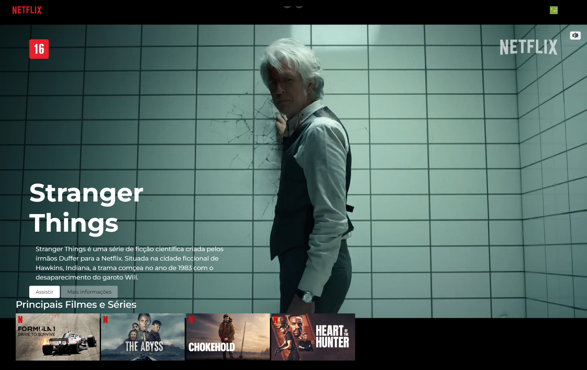

<h1 align="center"> DevFlix </h1>

Projeto Portfólio em HTML, CSS e JAVASCRIPT.  

  <a href="#-tecnologias">Tecnologias</a>&nbsp;&nbsp;&nbsp;|&nbsp;&nbsp;&nbsp;
  <a href="#-projeto">Projeto</a>&nbsp;&nbsp;&nbsp;|&nbsp;&nbsp;&nbsp;
  <a href="#-layout">Layout</a>&nbsp;&nbsp;&nbsp;|&nbsp;&nbsp;&nbsp;
  <a href="#memo-licença">Licença</a>

 

  

## 🚀 Tecnologias

Esse projeto foi desenvolvido com as seguintes tecnologias:

- Html
- Css
- JavaScript
- Git e Github

## 💻 Projeto

Página que simula a tela principal do Stream da NetFlix.

- [Acesse o projeto finalizado, online](https://schubertsantos.github.io/devflix)

## 🔖 O que foi aprendido nesse Projeto de Estudos

- Página simulando a NetFlix e nomeada como DevFlix
- Vídeo já começa rodando e também existe o botão de "Tudum" igual no site da NetFlix.
- Slyde de filmes indicados rodando automaticamente.

---

